# vodafone-financial-analysis
> Automated financial table extraction and standardization from Vodafone's annual report using GPT-4o-mini

## Table of Contents
- [Overview](#overview)
- [Project Structure](#project-structure)
- [Features](#features)
- [Solution Architecture](#solution-architecture)
- [Usage](#usage)
- [Implementation Details](#implementation-details)
- [Results](#results)
- [Future Enhancements](#future-enhancements)
- [License](#license)

## Overview
This project automates the extraction and standardization of financial tables from Vodafone's annual report using GPT-4o-mini. Developed for the Crediflow AI Assignment, it addresses:

1. Extraction of financial tables from PDF report
2. Standardization of Balance Sheet terminology
3. Future optimization proposals

## Project Structure
```
vodafone-financial-analysis/
├── extracted_data/                 
│   ├── extracted_text.txt           # Raw extracted text
│   ├── extraction_validation.log    # Validation logs
│   └── processed_vocabulary.json    # Processed vocabulary terms
├── financial_tables/
│   ├── INCOME_STATEMENT.csv
│   ├── STATEMENT_OF_COMPREHENSIVE_INCOME.csv
│   ├── STATEMENT_OF_FINANCIAL_POSITION.csv
│   └── financial_tables.md
├── standardized_output/
│   ├── standardized_balance_sheet.csv
│   └── standardized_balance_sheet.md
├── input/
│   ├── vocabulary.rtf              # Vocabulary list
│   └── vodafone_annual_report.pdf  # Source PDF
├── docs/
│   ├──  workflow.svg                # Solution workflow diagram
│   └── Crediflow_AI_Assignment.ipynb 
└── README.md
```

## Features
- PDF text extraction with OCR fallback
- GPT-4o-mini powered table identification
- Financial term standardization
- Multiple output formats (Markdown, CSV)
- Detailed validation and logging

## Solution Architecture

[//]: # "Insert workflow diagram here"


## Usage
[](https://colab.research.google.com/drive/1hrjoKFIDsxRZfuGJYMr_vTO_YlUR3wXd?usp=sharing)

### Quick Start
1. Add input files from `/input` directory to the notebook
2. Run text extraction notebook
3. Process financial tables
4. Check outputs in respective directories

## Implementation Details

### Question 1: Table Extraction
Successfully extracted three financial tables:

| Table Type | Status | Output Location |
|------------|--------|-----------------|
| Income Statement | ✅ | financial_tables/INCOME_STATEMENT.csv |
| Balance Sheet | ✅ | financial_tables/STATEMENT_OF_FINANCIAL_POSITION.csv |
| Comprehensive Income | ✅ | financial_tables/STATEMENT_OF_COMPREHENSIVE_INCOME.csv |

### Question 2: Balance Sheet Standardization
Implemented term standardization using:
- GPT-4o-mini for semantic matching
- Predefined vocabulary from RTF file
- Structure preservation
- Numerical accuracy validation

Results available in:
- standardized_output/standardized_balance_sheet.csv
- standardized_output/standardized_balance_sheet.md

### Question 3: Future Optimizations

#### Technical Improvements
- Batch processing capabilities
- Enhanced error handling
- Improved OCR accuracy

#### Feature Additions
- Support for multiple file formats

#### Quality Enhancements
- Comprehensive validation
- Performance optimization
- Enhanced logging
- Better error reporting

## Results
Successfully processed Vodafone's annual report with:
- Three financial tables extracted
- Standardized Balance Sheet terminology
- Structured outputs in CSV and MD formats
- Preserved numerical accuracy
- Maintained hierarchical relationships

## Dependencies
- Python 3.8+
- OpenAI API access
- Required libraries:
  ```
  pytesseract
  pdf2image
  PyPDF2
  pandas
  openai
  striprtf
  ```

## License
MIT License

---
Created as part of the Crediflow AI Assignment
```
